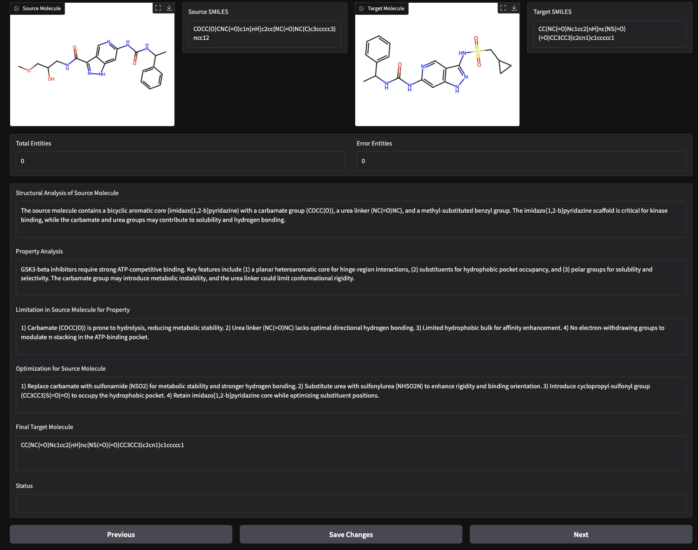

# 分子标注系统

一个基于Gradio的分子转化数据标注界面，支持思维链(CoT)推理标注。

## 功能特点

- 从SMILES字符串可视化源分子和目标分子
- 编辑并保存思维链(CoT)标注结果
- 记录总实体数和错误实体数
- 通过"上一页/下一页"按钮浏览数据集
- 自动保存到单独文件和主数据集

## 安装步骤

1. 克隆本仓库
2. 安装所需依赖包：

```bash
pip install rdkit gradio
```

## 使用方法

运行标注界面：

```bash
python annotate.py --data_path PATH_TO_YOUR_DATA --output_dir PATH_TO_OUTPUT_DIR
# 例如
python annotate.py --data_path gsk_hard_cot.json --output_dir annotated_data

# 然后根据terminal 显示在端口打开标注界面，例如： http://127.0.0.1:7860/
```

标注界面demo




示例数据格式

```json
[
  {
    "src": "源分子SMILES",
    "tgt": "目标分子SMILES",
    "total_entity": 0,
    "error_entity": 0,
    "cot_result": "{\"reasoning\":\"...\",\"steps\":[...]}"
  }
]
```

## 注意事项

- 确保输入JSON文件格式正确
- 保存时会同时更新主文件和单个标注文件
- 建议定期备份原始数据